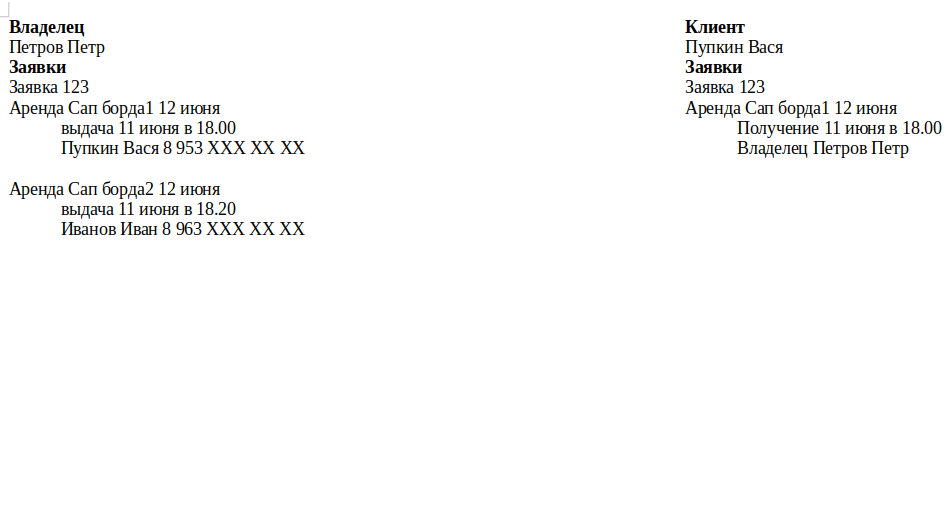

# rental application

rental application - это приложение в котором владелец может выставить свои вещи в прокат или аренду, 
а клиент может взять эти вещи в прокат или в аренду. 
Задача приложения - предоставить возможность владельцу и клиенту тратить меньше времени на согласование 
времени выдачи вещей в прокат и их аренды.

## Визуальная схема фронтенда

## Документация

1. Маркетинг
   1. [Заинтересанты](./docs/01-marketing/01-stakeholders.md)
   2. [Целевая аудитория](./docs/01-marketing/02-target-audience.md)
   3. [Конкурентный анализ](./docs/01-marketing/03-concurrency.md)
   4. [Анализ экономики](./docs/01-marketing/04-economy.md)
   5. [Пользовательские истории](./docs/01-marketing/05-user-stories.md)
2. DevOps
   1. [Схема инфраструктуры](./docs/02-devops/01-infrastruture.md)
   2. [Схема мониторинга](./docs/02-devops/02-monitoring.md)
3. Тесты
4. Архитектура
   1. [Архитектурная диаграмма](./docs/04-architecture/01-arch.md)
   2. [Схема интеграции](./docs/04-architecture/02-integration.md)
   3. [API](./docs/04-architecture/03-api.md)

# Структура проекта

## Транспортные модели, API

1. [specs](specs) - описание API в форме OpenAPI-спецификаций
2. [rental-app-api-v1](rental-app-api-v1) - Генерация первой версии транспортных моделей
3. [rental-app-api-log](rental-app-api-log) - Генерация первой версии моделей логирования
4. [rental-app-model](rental-app-model) - модуль с общими классами для модулей проекта. В частности, там
   располагаются внутренние модели и контекст.
5. [rental-app-mappers-v1](rental-app-mappers-v1) - Мапер между внутренними моделями и моделями API v1
6. [rental-app-mappers-log](rental-app-mappers-log) - Мапер между внутренними моделями и моделями логирования
   первой версии

## Фреймворки и транспорты

1. [rental-app-spring](rental-app-spring) - Приложение на Spring Framework
2. [rental-app-kafka](rental-app-kafka) - Микросервис на Kafka

## Мониторинг и логирование

1. [deploy](deploy) - Инструменты мониторинга и деплоя
2. [rental-app-lib-logging](rental-app-lib-logging) - Общие объявления для логирования
3. [rental-app-lib-logging-logback](rental-app-lib-logging-logback) - Библиотека логирования на базе библиотеки
   Logback

## Модули бизнес-логики

1. [rental-app-stubs](rental-app-stubs) - Стабы для ответов сервиса
2. [ok-marketplace-lib-cor](ok-marketplace-lib-cor) - Библиотека цепочки обязанностей для бизнес-логики
3. [rental-app-biz](rental-app-biz) - Модуль бизнес-логики приложения: обслуживание стабов, валидация, работа с БД

# Хранение, репозитории, базы данных

1. [rental-app-repo-tests](rental-app-repo-tests) - Базовые тесты для репозиториев всех баз данных
2. [rental-app-repo-in-memory](rentap-app-repo-in-memory) - Репозиторий на базе кэша в памяти для тестирования
3. [rental-app-repo-postgresql](rental-ap-repo-postgresql) - Репозиторий на базе PostgreSQL
